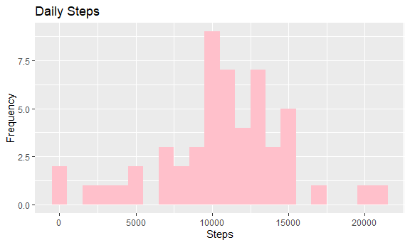
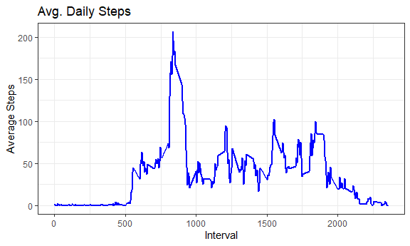

## Loading and preprocessing the data


```r
dir.create("data")
```

```
## Warning in dir.create("data"): 'data' already exists
```

```r
unzip("activity.zip",exdir = "data")
activity = read_csv("./data/activity.csv",col_types = "icc", na = "NA")

activity = activity %>% mutate(date = as.Date(date,  "%Y-%m-%d"))
```

## What is mean total number of steps taken per day?

1. Calculate the total number of steps taken per day


```r
step_perday = aggregate(activity$steps, list(activity$date), sum,na.rm = T)

names(step_perday)[1] = "date"
names(step_perday)[2] = "steps"
```

2.  Make a histogram of the total number of steps taken each day


```r
ggplot(data = step_perday, aes(x = steps)) + 
  geom_histogram(fill = "pink", binwidth = 1000) +
  labs(title = "Daily Steps", x = "Steps", y = "Frequency")
```

<!-- -->

3. Calculate and report the mean and median of the total number of steps taken per day


```r
mean_step = mean(step_perday$steps,na.rm = TRUE)
median_step = median(step_perday$steps,na.rm = TRUE)

output = cbind(mean_step,median_step)
output
```

```
##      mean_step median_step
## [1,]   9354.23       10395
```


## What is the average daily activity pattern?

Make a time series plot of the 5-minute interval (x-axis) and the average number of steps taken, averaged across all days (y-axis)


```r
step_perinterval = aggregate(activity$steps, list(activity$interval),mean,na.rm = T)

names(step_perinterval)[1] = "intervals"
names(step_perinterval)[2] = "ave_steps"


ggplot(step_perinterval, aes(x = intervals , y = ave_steps)) +
  geom_line(color ="blue", size=1) + 
  labs (title = "Avg. Daily Steps", x = "Interval", y = "Average Steps") + theme_bw()
```

```
## geom_path: Each group consists of only one observation. Do you need to adjust
## the group aesthetic?
```

<!-- -->

2. Which 5-minute interval, on average across all the days in the dataset, contains the maximum number of steps?


```r
n = which.max(step_perinterval$ave_steps)
max_interval = step_perinterval$intervals[n]
max_interval
```

```
## [1] "835"
```

## Imputing missing values

1. Calculate and report the total number of missing values in the dataset 

```r
sum(is.na(activity$steps))
```

```
## [1] 2304
```

2. Devise a strategy for filling in all of the missing values in the dataset. 

```r
activityDT <- data.table::fread(input = "data/activity.csv")

# Filling in missing values with median of dataset. 
activityDT[is.na(steps), "steps"] <- activityDT[, c(lapply(.SD, median, na.rm = TRUE)), .SDcols = c("steps")]
```

3. Create a new dataset that is equal to the original dataset but with the missing data filled in.


```r
data.table::fwrite(x = activityDT, file = "data/tidyData.csv", quote = FALSE)
```

